# Credit Card Clustering

The sample Dataset summarizes the usage behavior of about 9000 active credit card holders during the last 6 months. The file is at a customer level with 18 behavioral variables. You need to develop a customer segmentation to define marketing strategy from the dataset.

Full codes can be found [here](https://github.com/andreduong/credit-card-clustering/blob/master/credit-card-clustering.ipynb). [NBViewer Link](https://nbviewer.jupyter.org/github/andreduong/credit-card-clustering/blob/master/credit-card-clustering.ipynb#Data-Description).

# Objective

There are a lot of features in this dataset (18 behavioral features). We will now perform:

* Data preprocessing
* Clustering
* Feature extraction to improve clustering
* Experiment with various clustering models: KMeans, Agglomerative Hierarchical, Gaussian Mixture
* Choosing the number of clusters
* EDA to segment the customers
* Concluding the project by giving marketing strategy based on what we learn from the data

# Data Description

Link to the dataset: [Kaggle link](https://www.kaggle.com/arjunbhasin2013/ccdata)

Following is the Data Dictionary for Credit Card dataset:

* CUST_ID: Identification of Credit Card holder (Categorical)
* BALANCE: Balance amount left in their account to make purchases
* BALANCE_FREQUENCY: How frequently the Balance is updated, score between 0 and 1 (1 = frequently updated, 0 = not frequently updated)
* PURCHASES: Amount of purchases made from account
* ONEOFF_PURCHASES: Maximum purchase amount done in one-go
* INSTALLMENTS_PURCHASES: Amount of purchase done in installment
* CASH_ADVANCE: Cash in advance given by the user
* PURCHASES_FREQUENCY: How frequently the Purchases are being made, score between 0 and 1 (1 = frequently purchased, 0 = not frequently purchased)
* ONEOFFPURCHASESFREQUENCY: How frequently Purchases are happening in one-go (1 = frequently purchased, 0 = not frequently purchased)
* PURCHASESINSTALLMENTSFREQUENCY: How frequently purchases in installments are being done (1 = frequently done, 0 = not frequently done)
* CASHADVANCEFREQUENCY: How frequently the cash in advance being paid
* CASHADVANCETRX: Number of Transactions made with "Cash in Advanced"
* PURCHASES_TRX: Number of purchase transactions made
* CREDIT_LIMIT: Limit of Credit Card for user
* PAYMENTS: Amount of Payment done by user
* MINIMUM_PAYMENTS: Minimum amount of payments made by user
* PRCFULLPAYMENT: Percent of full payment paid by user
* TENURE: Tenure of credit card service for user

# Data Cleaning

One of the most important preprocessing steps in a Data Science project. In this project, I imputed missing values with the median value, dropped the CUST_ID column, then normalized the input values using StandardScaler(). You can check the codes [here](https://nbviewer.jupyter.org/github/andreduong/credit-card-clustering/blob/master/credit-card-clustering.ipynb#Data-Description).

# Clustering 

## Correlation Check

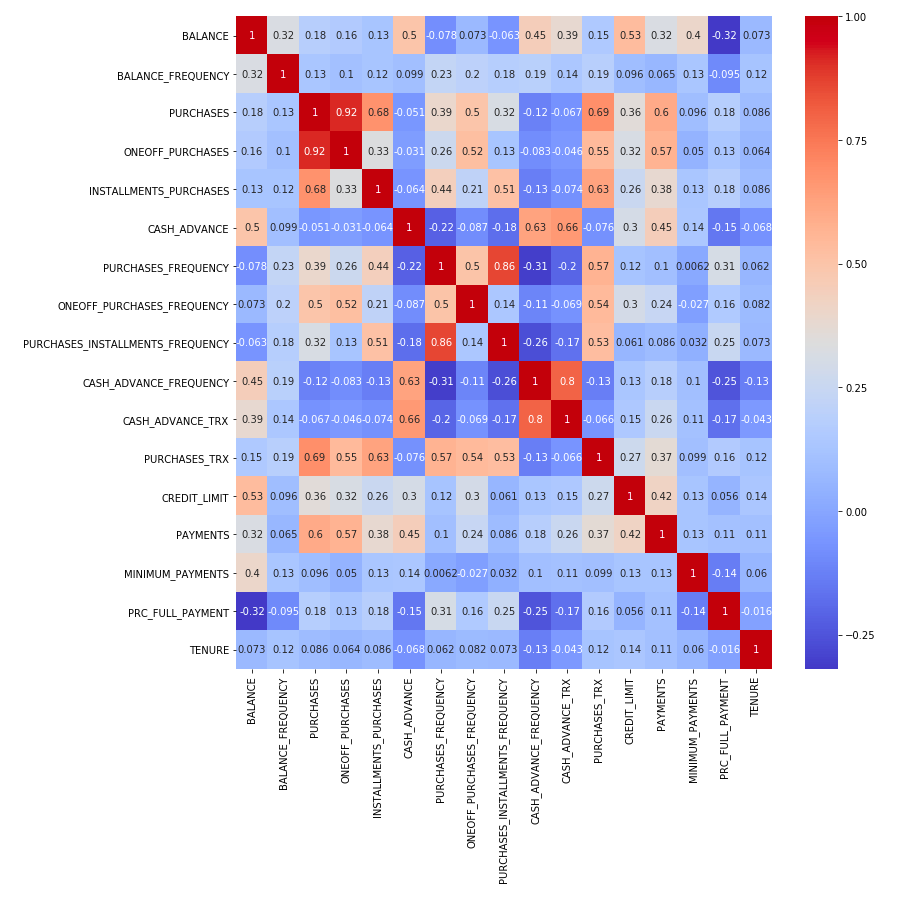

## Clustering using K-Means

In this section we will perform K-Means clustering on the data and check the clustering metrics (inertia, silhouette scores).

### Inertia Plot

First, we make the inertia plot:

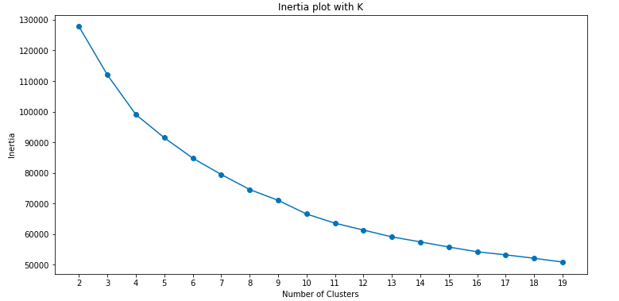

Using the elbow method, we pick a good number of clusters to be 6.

### Silhouette Scores

Silhouette analysis can be used to study the separation distance between the resulting clusters. The silhouette plot displays a measure of how close each point in one cluster is to points in the neighboring clusters and thus provides a way to assess parameters like number of clusters visually. This measure has a range of [-1, 1].

We will now check the silhouette scores for different numbers of clusters.

* Silhouette-Score for 2 Clusters:  0.20960465116695418
* Silhouette-Score for 3 Clusters:  0.2508020421643232
* Silhouette-Score for 4 Clusters:  0.1976791965228765
* Silhouette-Score for 5 Clusters:  0.19029814154984043
* Silhouette-Score for 6 Clusters:  0.20263819385025553

Silhouette plots:

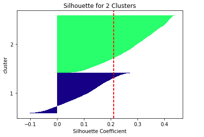

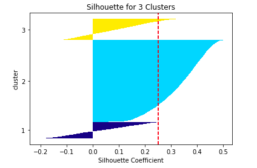

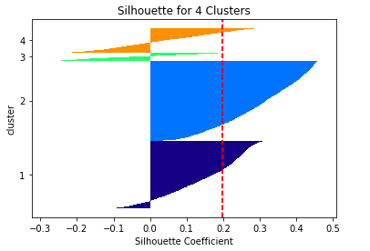

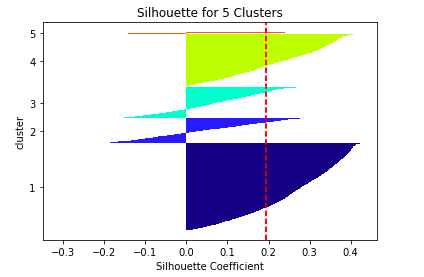

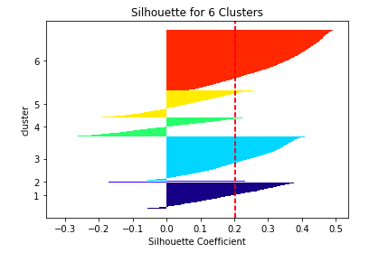

So far, we have a high average inertia, low silhouette scores, and very wide fluctuations in the size of the silhouette plots. This is not good. Let's apply feature extraction with PCA to improve clustering.

## Feature Extraction with PCA

### Clustering Metrics

Now we will apply PCA to improve clustering. We should be able to see lower inertias and higher silhouette scores after feature extraction.

PCA with # of components:  2

* Silhouette-Score for 2 Clusters:  0.46465479431270534        Inertia:  49682.73274051301
* Silhouette-Score for 3 Clusters:  0.4518351583555225         Inertia:  33031.47401545379
* Silhouette-Score for 4 Clusters:  0.4073585864501941         Inertia:  24544.24482589567
* Silhouette-Score for 5 Clusters:  0.4006605339188969         Inertia:  19475.027618054555
* Silhouette-Score for 6 Clusters:  0.3831171886914103         Inertia:  16227.77126102003

PCA with # of components:  3
* Silhouette-Score for 2 Clusters:  0.34138059980809216        Inertia:  62045.14795760842
* Silhouette-Score for 3 Clusters:  0.3797307331170353         Inertia:  46325.34921425197
* Silhouette-Score for 4 Clusters:  0.369279814360067          Inertia:  34659.74111687311
* Silhouette-Score for 5 Clusters:  0.36831384998922845        Inertia:  28591.733482974614
* Silhouette-Score for 6 Clusters:  0.3314415719819512         Inertia:  24847.61783847582

PCA with # of components:  4
* Silhouette-Score for 2 Clusters:  0.3057392880087437         Inertia:  73184.92491408344
* Silhouette-Score for 3 Clusters:  0.3432745593601783         Inertia:  57561.006831771716
* Silhouette-Score for 4 Clusters:  0.3219180239069211         Inertia:  45288.0674784414
* Silhouette-Score for 5 Clusters:  0.31998686049621133        Inertia:  39166.378524827924
* Silhouette-Score for 6 Clusters:  0.2884156635668477         Inertia:  35301.53554112003

As you can see, 2 PCA components with 5-6 clusters would be our best bet.

## Visualization

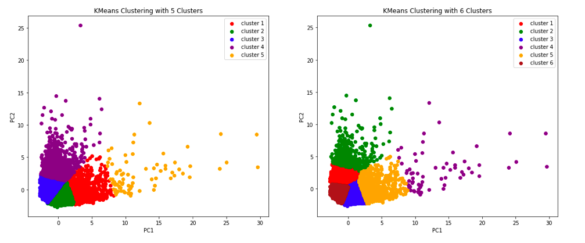

So far, by applying PCA we have made notable improvement to KMeans model. Let's try other clustering models as well!

## Agglomerative Hierarchical Clustering with PCA

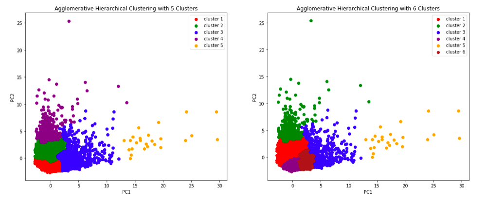

## Gaussian Mixture Clustering with PCA

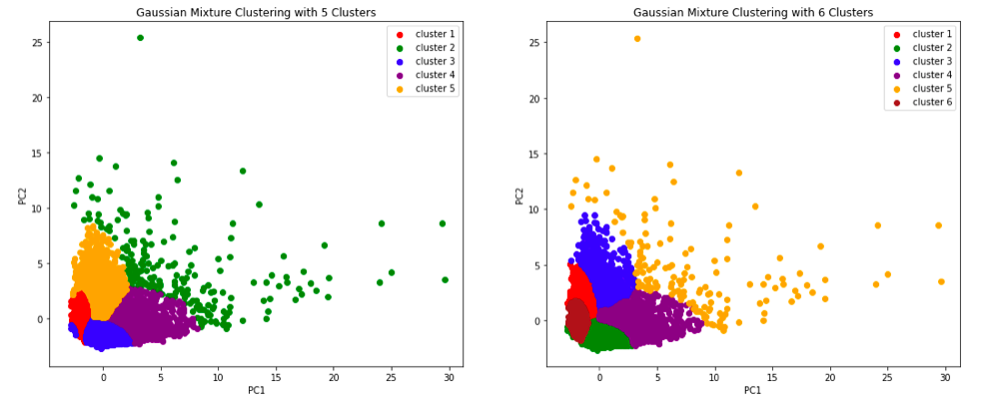

# Exploratory Data Analysis

We are picking 6 clusters for this EDA. Let's make a Seaborn pairplot with selected/best columns to show how the clusters are segmenting the samples:

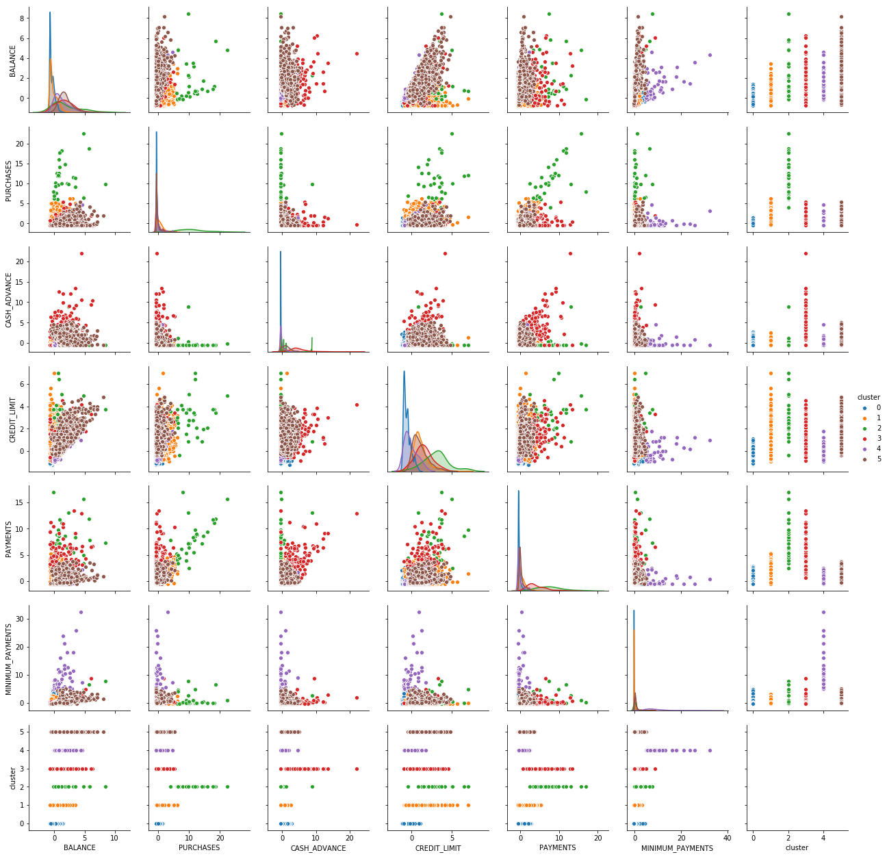

We can see some interesting correlations between features and clusters that we have made above. Let's get into detailed analysis.

## Cluster 0 (Blue): The Average Joe

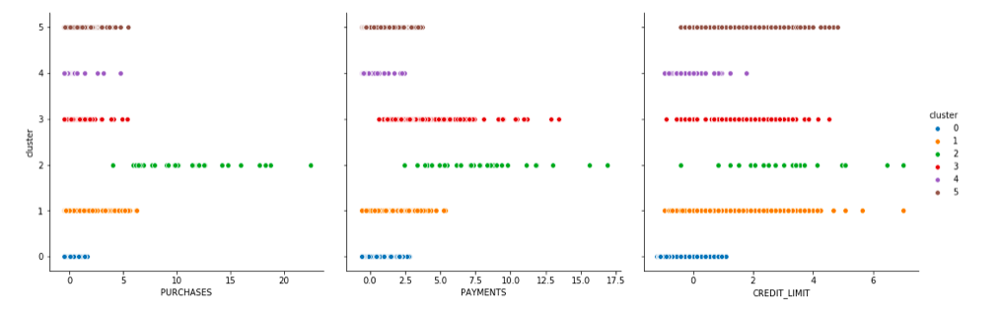

This group of users, while having the highest number of users by far, is fairly frugal: they have lowest purchases, second lowest payments, and lowest credit limit. The bank would not make much profit from this group, so there should be some sorts of strategy to attract these people more.

## Cluster 1 (Orange): The Active Users

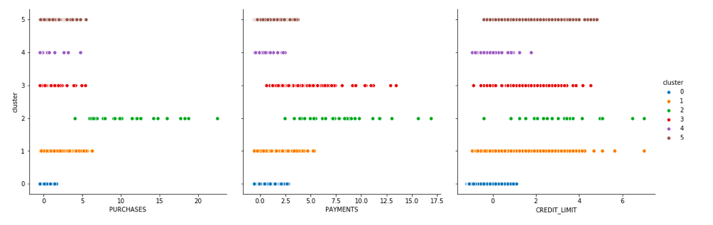

This group of users is very active in general: they have second highest purchases, third highest payments, and the most varied credit limit values. This type of credit card users is the type you should spend the least time and effort on, as they are already the ideal one.

## Cluster 2 (Green): The Big Spenders

The Big Spenders. This group is by far the most interesting to analyze, since they do not only have the highest number of purchases, highest payments, highest minimum payments, but the other features are also wildly varied in values. Let's take a quick look at the pairplots.

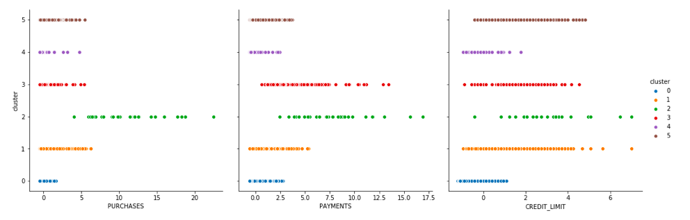

As a nature of "Big Spenders", there are many outliers in this cluster: people who have/make abnormally high balance, purchases, cash advance, and payment. The graph below will give you an impression of how outlier-heavy this cluster is - almost all the green dots are outliers relatively compared to the rest of the whole dataset.

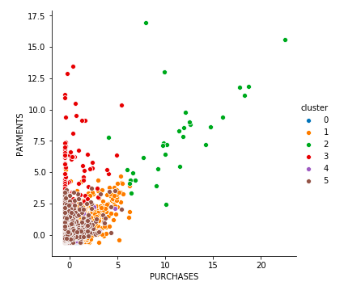

## Cluster 3 (Red): The Money Borrowers

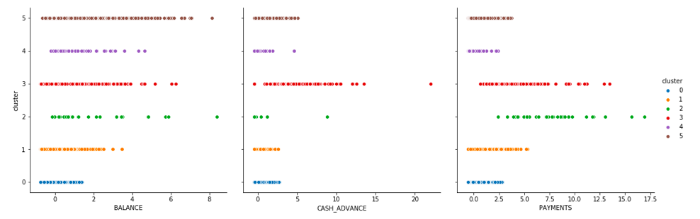

Wildly varied balance, second highest payments, average purchases. The special thing about this cluster is that these people have the highest cash advance by far - there is even one extreme case that has like 25 cash advance points. We call these people "The Money Borrowers".

## Cluster 4 (Purple): The High Riskers

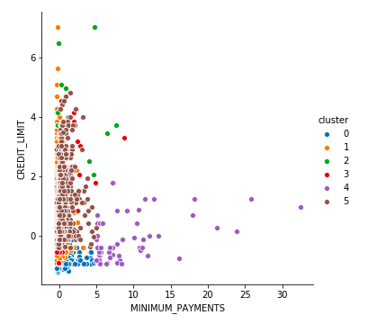

This group has absurdly high minimum payments while having the second lowest credit limit. It looks like the bank has identified them as higher risk.

## Cluster 5 (Brown): The Wildcards

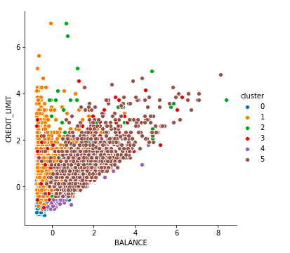

This group is troublesome to analyze and to come up with a good marketing strategy towards, as both their credit limit and balance values are wildly varied. As you can see, the above graph looks like half of it was made of the color brown!

# Summary and Possible Marketing Strategy

We have learned a lot from this dataset by segmenting the customers into six smaller groups: the Average Joe, the Active Users, the Big Spenders, the Money Borrowers, the High Riskers, and the Wildcards. To conclude this cluster analysis, let's sum up what we have learned and some possible marketing strategies:

* The Average Joe do not use credit card very much in their daily life. They have healthy finances and low debts. While encouraging these people to use credit cards more is necessary for the company's profit, business ethics and social responsibility should also be considered.

* Identify active customers in order to apply proper marketing strategy towards them. These people are the main group that we should focus on.

* Some people are just bad at finance management - for example, the Money Borrowers. This should not be taken lightly.

* Although we are currently doing a good job at managing the High Riskers by giving them low credit limits, more marketing strategies targeting this group of customers should be considered.

# Conclusion

In this project, we have performed data preprocessing, feature extraction with PCA, looked at various clustering metrics (inertias, silhouette scores), experimented with various Clustering algorithms (KMeans Clustering, Agglomerative Hierarchical Clustering, Gaussian Mixture Clustering), data visualizations, and business analytics.

This project is also my first try on the business side of Data Science, and how we can use Machine Learning to solve practical, real life issues.
